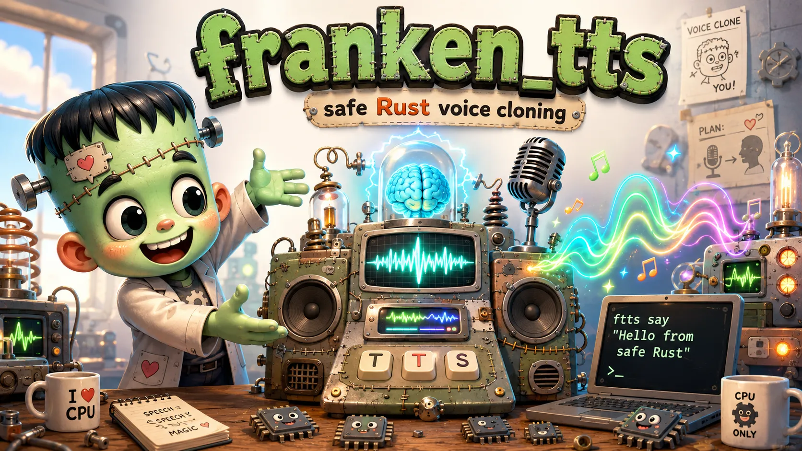

# franken_tts



**A pure-Rust, memory-safe, CPU-only runtime for one text-to-speech model: [Qwen3-TTS-12Hz-0.6B-Base](https://huggingface.co/Qwen/Qwen3-TTS-12Hz-0.6B-Base). Zero-shot voice cloning with no Python, no ML framework, and no GPU at inference.**

[](LICENSE)
[](https://www.rust-lang.org/)
[](https://github.com/Dicklesworthstone/franken_tts/releases)

```bash
curl -fsSL https://raw.githubusercontent.com/Dicklesworthstone/franken_tts/main/install.sh | bash
```

Sibling of [franken_ocr](https://github.com/Dicklesworthstone/franken_ocr) and franken_whisper: one fixed model revision, model-specific kernels, and no pretense of being a general speech framework.

---

## TL;DR

**The problem.** Running a modern voice-cloning TTS model normally means dragging in Python, PyTorch, and a GPU for a 0.6B-parameter model. And Qwen3-TTS's public story of "a 12.5 Hz model" hides its real CPU cost: a **15-step autoregressive residual-code microdecoder inside every 80 ms frame**. The 28-layer talker runs once, then a 5-layer code predictor runs *fifteen sequential times* (per-depth embeddings, per-depth 2,048-way heads), then a causal codec decodes. First-order Q8 weight traffic is ≈1.65 GB per frame; the microdecoder body accounts for ~1.18 GB of it, reread 15×.

**The solution.** `franken_tts` reimplements the whole pipeline in safe Rust, verified seam-by-seam against the upstream PyTorch model, and treats that hidden microdecoder as the primary optimization target rather than a liability: cache-resident hot-packing, per-depth quantization, and **FrankenMTP**, speculative block drafting that the 5-layer predictor itself verifies exactly in a single causal pass. Those three are the roadmap; the f32 reference engine ships today.

| Why franken_tts | |
|---|---|
| **One binary, no runtime deps** | `ftts say "text" --voice v.spk -o out.wav`. No Python, no PyTorch, no CUDA. |
| **Memory-safe** | Pure Rust, end to end. |
| **Verified against the oracle** | Argmax-exact talker parity vs oracle through all 28 layers; whole-utterance codec codes exact vs oracle; audio envelope checked against the pinned PyTorch reference. |
| **Deterministic streaming** | Codec streaming output is bit-identical to offline decoding under every packet schedule. |
| **Agent-first** | `ftts robot schema` emits NDJSON events with stable exit codes. |

## Quick example

Three commands, no configuration:

```bash
ftts pull                              # one-time: fetch the pinned model (~2.4 GB, SHA-256 verified)
ftts enroll voice_memo.m4a --default   # clone a voice from any recording you have the right to use
ftts say "Now is the time for all good men to come to the aid of the agents" out.m4a
```

The model installs into `~/.cache/franken_tts/model` and every command finds it there automatically; `--model` and `FTTS_MODEL_DIR` remain available to point elsewhere.

The output format follows the extension. `.wav` comes straight from the built-in pure-Rust encoder; `.m4a`, `.mp3`, and `.flac` are converted from that WAV by whichever system encoder is present (`afconvert` on macOS, `ffmpeg`, `lame`, `flac`), and if none is found you get an error naming the tools rather than a silently different format. Generation stops at the model's EOS, with a text-proportional frame cap as a backstop; set `FTTS_MAX_FRAMES` only when you want an exact cap. `--model`, `--voice`, and `-o` remain available for explicit control.

## Status: v0.1.0, a working f32 reference engine

This is the first release. What works now:

- **Real speech out.** `ftts say` synthesizes complete utterances on Apple Silicon with the production sampling stack matching upstream runtime defaults: do_sample, temperature 0.9, top-k 50, repetition penalty 1.05, sampled subtalker.
- **Parity receipts.**
  - Talker: argmax-exact vs captured oracle activations through all 28 layers.
  - Codec: whole-utterance codes exact vs oracle at the engine level.
  - Audio: peak frame RMS 0.08578 vs 0.0859745 for the pinned PyTorch reference.
  - Streaming: codec streaming == offline, bit-identical, under all packet schedules.
- **Honest performance.** A 55-frame utterance takes ~60 s wall in a release build (~0.5 s/frame, plus a one-time ~30 s model load). That is 6–7× slower than real time, and deliberately so: the default path is the unoptimized f32 reference. The int8 route below is where the speed lives.

### Experimental int8 route (off by default)

The first quantized kernels have landed behind kill-switches. Everything below was measured on one M4 Pro under varying load, against this tree's own f32 reference rather than a pinned external incumbent, so treat the ratios as local evidence:

- `FTTS_INT8=1` runs the talker and microdecoder projection matmuls as W8A8 int8 (symmetric per-channel weights, dynamic per-row activations, exact i32 accumulation). Local synthesis speedup: roughly 5–7×.
- `FTTS_INT8_CODEC=convnext` (or `all`) extends int8 to the codec's dense projections. The codec alone drops from ~64 ms to ~26–33 ms per 80 ms frame; PCM SNR against the f32 codec on a real sampled utterance measured 41.4 dB for `convnext` and 32.6 dB for `all`.
- Three kernel tiers ship (plain scalar, an 8-lane variant kept only as a measurement control, and a NEON SDOT island), all proven exactly equal in i32 on every census shape by `ftts robot selftest` on your machine, with a small startup autotuner picking the winner per regime.

Why it stays off: int8 changes the numbers, and the shipping gate for that is listening-based quality evaluation, not kernel math. Under greedy decode the int8 token stream matched f32 exactly on one test utterance and diverged on most others (near-tie argmaxes flip, and the divergence compounds autoregressively), which is expected for a lossy route and is precisely what the pending quality gates exist to judge. Until they pass, f32 remains the default and the flags above are opt-in.

## Verification

Every seam of the pipeline is checked against captured ground truth, not judged by ear:

- **Pinned truth pack** with SHA-256 manifests for model weights and oracle captures.
- **Teacher-forced parity** against captured oracle activations at every seam of the graph.
- **Tolerances derived from the measured nondeterminism floor**, not picked to make tests pass.
- **DISCREPANCIES / NEGATIVE_EVIDENCE / PERF ledgers** recording what disagrees, what was ruled out, and what it costs.
- **Skip-honest test receipts**: a skipped test says why, on the record.

## Installation

**Homebrew (macOS/Linux):**

```bash
brew install dicklesworthstone/tap/franken-tts
```

**Install script:**

```bash
curl -fsSL https://raw.githubusercontent.com/Dicklesworthstone/franken_tts/main/install.sh | bash
```

**Cargo:**

```bash
cargo +nightly install ftts-cli --locked   # installs the `ftts` and `franken_tts` binaries
```

Prebuilt binaries cover macOS (arm64, x86_64), Linux (x86_64, arm64), and Windows (x86_64).

### Getting the model

Weights are not bundled with the binary; `ftts pull` fetches the pinned Qwen3-TTS-12Hz-0.6B-Base snapshot (~2.4 GB, Apache-2.0 by Qwen) from this project's [model release](https://github.com/Dicklesworthstone/franken_tts/releases/tag/model-qwen3-tts-v1) into `~/.cache/franken_tts/model`, verifying every file's SHA-256 against the manifest embedded in the binary. Re-running `ftts pull` verifies and skips files already present. You can instead download the same snapshot from [Hugging Face](https://huggingface.co/Qwen/Qwen3-TTS-12Hz-0.6B-Base) manually and point the CLI at it with `--model <dir>` or `FTTS_MODEL_DIR`.

## Cloning your voice, step by step

1. Install `ftts` (above), then fetch the model once: `ftts pull`.
2. **Record about 30 to 50 seconds of yourself reading the passage below**, in a quiet room, at your natural pace, on any device — a phone voice memo is fine. Any common format works (`.m4a`, `.mp3`, `.wav`, `.flac`).
3. Enroll it as your default voice:

   ```bash
   ftts enroll my_recording.m4a --default
   ```

   Enrollment computes a 1,024-float speaker embedding from the audio alone — **no transcript is needed**. The enroll step warns about recordings that will clone poorly (background noise, clipping, whispering, multiple speakers). Use `-o name.spk` instead of `--default` to keep several voices and select one per-run with `--voice name.spk`.
4. Speak:

   ```bash
   ftts say "Hello from my cloned voice" hello.m4a
   ```

### The enrollment passage

Any natural speech works, but a phonetically rich passage measurably beats casual filler — this is to voices what "the quick brown fox" is to fonts. The script below combines the two standards from speech science: the **Rainbow Passage** (built to contain essentially every English phoneme and connected-speech transition) and the Speech Accent Archive's **"Please call Stella"** elicitation paragraph (dense with discriminative consonant clusters and vowels). Read both, in order, as one recording:

> Please call Stella. Ask her to bring these things with her from the store: six spoons of fresh snow peas, five thick slabs of blue cheese, and maybe a snack for her brother Bob. We also need a small plastic snake and a big toy frog for the kids. She can scoop these things into three red bags, and we will go meet her Wednesday at the train station.
>
> When the sunlight strikes raindrops in the air, they act as a prism and form a rainbow. The rainbow is a division of white light into many beautiful colors. These take the shape of a long round arch, with its path high above, and its two ends apparently beyond the horizon. There is, according to legend, a boiling pot of gold at one end. People look, but no one ever finds it. When a man looks for something beyond his reach, his friends say he is looking for the pot of gold at the end of the rainbow.

Keep a note of exactly what you read: the upcoming higher-quality ICL cloning mode conditions on the reference audio *plus its verbatim transcript*, so a recording of a known passage is already future-proof.

## Robot mode

`franken_tts` is built agent-first. `ftts robot schema` prints the NDJSON event schema; synthesis runs emit machine-readable events and exit with stable, documented codes, so orchestrators and coding agents can drive it without scraping human-facing text. Two subcommands report the kernel state of the machine they run on: `ftts robot selftest` executes the integer-overflow proof rows through every dispatchable kernel tier and reports per-row verdicts, and `ftts robot backends` lists available tiers, the dispatched route, detected ISA features, and the autotuned kernel plan.

## Architecture

```
text ──► 28-layer talker (runs once per 80 ms frame)
              │
              ▼
     5-layer code predictor ── runs 15× per frame
     (per-depth embeddings,    (autoregressive residual
      per-depth 2,048-way       -code microdecoder)
      heads)
              │
              ▼
       causal codec decoder ──► 24 kHz WAV
```

Workspace crates: `ftts-core` (engine), `ftts-model-qwen` (model graph), `ftts-kernels` (compute kernels), `ftts-artifacts` (weight/artifact handling), `ftts-conformance` (oracle parity suites), `ftts-cli` (the `ftts` binary).

## Known limitations

- **Slower than real time by default.** The f32 reference path runs 6–7× slower than real time on M-series. The experimental int8 route closes most of that gap but stays opt-in until its quality gates pass.
- **int8 quality is unproven.** The int8 kernels are exact integer math, but quantization changes the model's numbers; listening-based evaluation of the sampled production path has not run yet.
- **No quantized artifacts ship yet.** int8 currently quantizes at load time; the `.fttsq` artifact pipeline for pre-quantized weights is still in progress.
- **Voice quality depends on the reference voice** you enroll.
- **EOS stop timing is sampling-dependent.** A text-proportional frame cap backstops it by default; set `FTTS_MAX_FRAMES` for an exact cap.
- **Compressed output needs a system encoder.** `.m4a`, `.mp3`, and `.flac` shell out to `afconvert`, `ffmpeg`, `lame`, or `flac`; `.wav` needs nothing.

## Responsible use

Voice cloning is dual-use. This project records consent attestation and provenance in voice packs, ships no audio-acquisition features, preserves any upstream watermarking, and treats identity claims as settled by blind listening, not embedding cosines. Clone voices you have the right to clone.

## About Contributions

*About Contributions:* Please don't take this the wrong way, but I do not accept outside contributions for any of my projects. I simply don't have the mental bandwidth to review anything, and it's my name on the thing, so I'm responsible for any problems it causes; thus, the risk-reward is highly asymmetric from my perspective. I'd also have to worry about other "stakeholders," which seems unwise for tools I mostly make for myself for free. Feel free to submit issues, and even PRs if you want to illustrate a proposed fix, but know I won't merge them directly. Instead, I'll have Claude or Codex review submissions via `gh` and independently decide whether and how to address them. Bug reports in particular are welcome. Sorry if this offends, but I want to avoid wasted time and hurt feelings. I understand this isn't in sync with the prevailing open-source ethos that seeks community contributions, but it's the only way I can move at this velocity and keep my sanity.

## License

Runtime code: MIT with an OpenAI/Anthropic rider (see [LICENSE](LICENSE)). Model weights: Apache-2.0 by Qwen; the Apache attribution text is embedded in the binary and preserved in converted artifacts.
