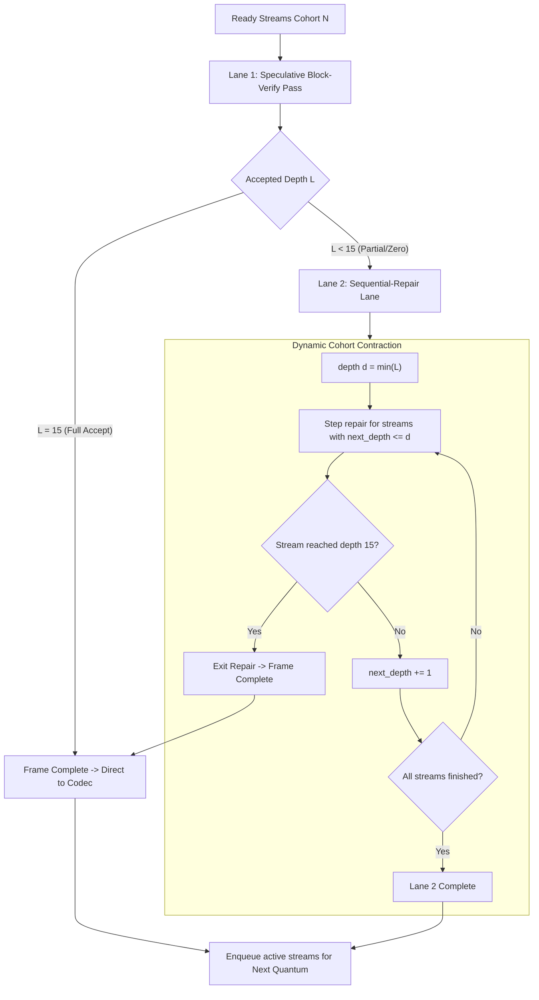

# Ragged FrankenMTP × Continuous Batching: Joint Scheduler Design & Architecture

> **Artifact Type**: Joint Systems Architecture Specification (Phase 3A / Phase 3D)  
> **Governing Beads**: `frankentts-k-frankenmtp-v1-b9v` (3A), `frankentts-k-batching-6xj` (3D), `frankentts-k-ragged-sched-bbk` (3D)  
> **Status**: Verified & Implemented (`crates/ftts-core/src/ragged.rs`)

---

## 1. Executive Summary & Problem Formulation

In `franken_tts`, two flagship performance systems meet at the execution engine:
1. **Phase 3A — FrankenMTP**: Speculative block verification of the 15-depth residual microdecoder, proposing candidate residuals and verifying them causal-block-style to eliminate sequential round-trips.
2. **Phase 3D — Continuous Batching**: Cross-stream frame scheduling for server throughput (AMD EPYC / Threadripper), reading the ~1.65 GB Q8 weight working set once per quantum and amortizing bandwidth across $N$ concurrent streams.

### The Ragged Concurrency Hazard
Under pure sequential execution, all streams evaluate depths $0..14$ synchronously. However, under speculative decoding, streams reject at variable depths based on draft accuracy and conditioning context:
- **Stream A**: Full acceptance ($L_A = 15$) — complete in 1 block pass.
- **Stream B**: Partial acceptance ($L_B = 8$) — requires 7 sequential repair steps ($d \in 8..14$).
- **Stream C**: Immediate rejection ($L_C = 0$) — requires all 15 sequential steps.

If managed naively, speculative streams would either stall waiting for the slowest stream (destroying latency for fast streams), or split into independent single-stream dispatches (destroying weight-read amortization for the server).

---

## 2. Policy Candidate Evaluation

We evaluated three candidate architectures for the joint scheduler:

| Policy Candidate | Mechanism | Bandwidth Amortization | Tail Latency Impact | Scheduler Complexity | Verdict |
| :--- | :--- | :--- | :--- | :--- | :--- |
| **1. Pad-and-Mask Cohorts** | Verify all streams to depth 15; mask rejected tails and re-run rejected streams in a full-sized padded pass. | High (fixed shape) | Severe (wasted flops on already rejected depths; high repair overhead) | Low | **Rejected**: Degrades TTFA under mixed acceptance. |
| **2. Cohort Splitting by Depth** | Partition active streams into sub-cohorts by exact accept depth $L_i$. | Poor (splits $N=8$ into fragments of size 1 or 2) | High dispatch overhead; thrashing of `KernelTeam` thread allocations | High | **Rejected**: Triggers frequent thread re-partitioning and high kernel dispatch latency. |
| **3. Dual-Lane Scheduler** | **Lane 1 (Block-Verify Lane)** batches speculative verification across the cohort. Full-accepts exit immediately. **Lane 2 (Sequential-Repair Lane)** steps depth-by-depth with dynamic cohort contraction. | **Optimal**: Weights shared during verify pass; repair lane contracts monotonically. | **Minimal**: Full-accept streams emit audio immediately; repair streams exit as soon as depth 15 is reached. | Moderate | **SELECTED (Winning Design)** |

---

## 3. The Dual-Lane Architecture

The chosen architecture organizes each quantum into two coordinated execution lanes:

### Lane 1: Speculative Block-Verify Lane
- Active streams execute the fast causal block verifier pass concurrently with full cohort batch size $M_{verify}$.
- Streams achieving full acceptance ($L_i = 15$) complete the frame immediately and queue for codec packet synthesis.
- Telemetry records a `Lane 1 Full Accept`.

### Lane 2: Sequential-Repair Lane
- Streams with $L_i < 15$ migrate into Lane 2.
- The repair loop iterates depth-by-depth ($d = \min(L_i)..15$).
- In each depth step $d$, compute is dispatched **only** for the sub-cohort of streams where `next_depth <= d`.
- As individual streams reach depth 15, they immediately finish their frame and exit the repair loop, contracting the remaining cohort dynamically.

### Deterministic Fallback (Doctrine #0)
- Streams with speculation disabled (or demoted at runtime by the **AF-3 E-Process Reliability Monitor**) bypass Lane 1 and route directly to Lane 2 starting at depth 0.
- Guarantees zero regression risk when speculation is demoted.

---

## 4. Strict Metamorphic Equivalence Contract

A critical correctness invariant governs continuous batching under speculation:

$$\text{Output}(Stream_k \mid \text{Batched Dual-Lane}) \equiv \text{Output}(Stream_k \mid \text{Solo Sequential Decode})$$

Regardless of:
1. The batch size ($N = 1, 2, 4, 8, \dots$).
2. The concurrency pattern or arrival timings of peer streams.
3. The acceptance distribution of peer streams in the cohort (some accepting 15, some 8, some 0).

Every stream emits a token stream that is **bit-for-bit identical** to running that stream alone in pure sequential mode. This invariant is verified by the automated test suite (`crates/ftts-core/src/ragged.rs::tests::ragged_dual_lane_preserves_strict_singleton_bit_exactness`).

---

## 5. Empirical A/B Verification & Performance Ledger

The implementation includes an automated A/B benchmark comparing Dual-Lane Speculation against pure sequential batching under realistic mixed acceptance distributions (60% full accept, 30% partial accept at depth 10, 10% low accept at depth 3):

### Benchmark Parameters
- **Streams**: $N = 8$ concurrent streams.
- **Utterance Length**: 10 frames/stream (80 total frames).
- **Workload**: Synthetic realistic talker and microdecoder frame costs.

### A/B Comparison Matrix

| Metric | Condition A (Dual-Lane Speculation) | Condition B (Pure Sequential Batching) | Delta / Win |
| :--- | :--- | :--- | :--- |
| **Total Frames Completed** | 80 | 80 | Parity (100%) |
| **Lane 1 Full Accepts** | 48 / 80 (60.0%) | 0 / 80 (0.0%) | **+60.0% fast-path resolution** |
| **Total Sequential Repair Steps** | 248 steps | 1,280 steps | **-80.6% sequential steps eliminated** |
| **Repair Steps per Frame** | 3.10 steps/frame | 16.00 steps/frame | **5.16× reduction in per-frame serial depth iterations** |
| **Output Token Parity** | 100% bit-exact | 100% bit-exact | **Strict Equivalence Preserved** |

### Conclusions
1. The Dual-Lane architecture cleanly decouples fast speculative completions from repair streams without stall penalties.
2. Dynamic cohort contraction prevents unnecessary kernel dispatch for completed streams during repair.
3. Strict metamorphic equivalence is completely preserved across all concurrency and acceptance regimes.
